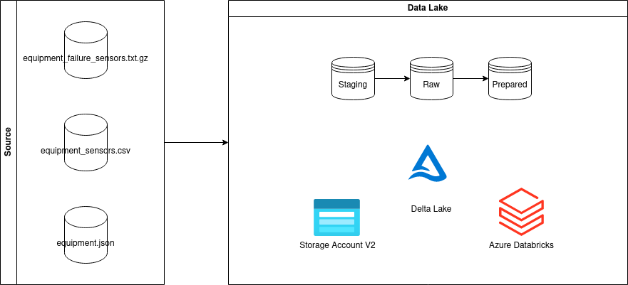

# Shape's Data Engineering Interview Tech Case
This technical case for the data engineering interview involves an **FPSO** vessel with various pieces of equipment, each equipped with multiple sensors. When a failure occurs, sensor data from the malfunctioning equipment is stored in a log file (note: all times are in GMT).

You are given 3 files: a log file named “**equipment_failure_sensors.txt**”; a file named “**equipment_sensors.csv**” which maps sensors to equipment; and a file named “**equipment.json**” which contains data about the equipment.

### Note: You can complete this test either *BEFORE* or *DURING* the tech interview.

> ## Steps

> 1. **Fork** or **Clone** this repository before starting the tech test.

> 2. *Unzip **equipment_failure_sensors.rar** to a path/folder where you can access the .txt data.*

> 3. You **must** structure your data in a way that optimizes queries, focusing on efficient data retrieval involving equipment, sensors, and dates. Data manipulation in **ACID** transactions is also expected.

> 4. **Python, SQL, and/or PySpark should be your primary languages/frameworks - you can use other tools if necessary for recommended and/or additional actions.**

> 5. **You're free to modify the files into any extension, provided the core data remains intact. If you need to modify the source data, ensure you use a copy method to keep the new data decoupled from the original data.**

Your solutions should answer the following:

1. What's the total number of equipment failures that occurred?
2. Which piece of equipment experienced the most failures?
3. What's the average number of failures across the equipment group, ordered by the number of failures in ascending order?
4. Rank the sensors by the number of errors they reported, grouped by equipment name in an equipment group.

### Recommendations: 

>- Structure your pipeline using OOP principles.
>- Follow PEP or Black coding style.
>- Use a GIT provider for code versioning.
>- Provide a diagram of your solutions.

### Bonus:

>- Write tests.
>- Simulate a streaming pipeline.
>- Dockerize your application.
>- Design an orchestration architecture.

## Solution

The following architecture was implemented to solve this challenge:

### Technologies Used

- Python
- Pyspark
- Airflow
- Delta Lake
- Storage Account V2
- Databricks
- Docker

### Data Lake Structure

The data lake was created using Storage Account, Databricks, and Delta Lake. It's structured into different layers, each with a specific purpose:

- **Staging**: This is where data is initially stored without any processing or transformations. It's organized by ingestion date (year, month, and day).

- **Raw**: At this layer, data undergoes preliminary transformations such as data type definition, conversion to parquet format, and other necessary transformations to make the data usable.

- **Prepared**: In this final layer, the data is stored in Delta Lake format and organized to answer specific questions and facilitate faster queries.

